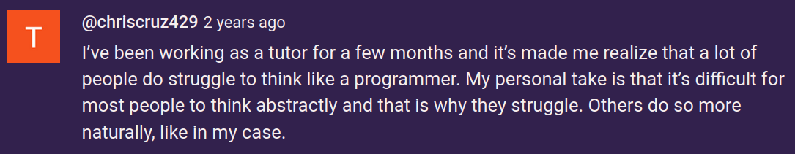
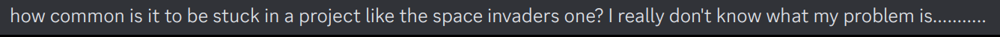
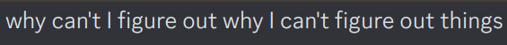
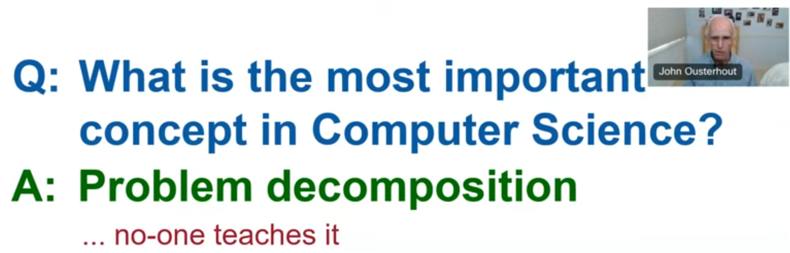
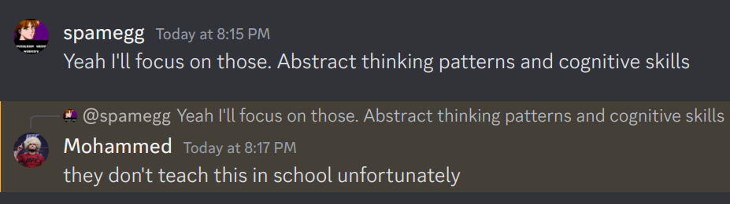

# Elements of Abstract Thinking

Welcome to the world of ***abstract nonsense!***

## Motivation

I've been trying to figure out the underlying reasons why many are struggling with mathematics and computer science, *even when they have great resources and they study the subjects.* 

### The Usual Suspects

> ***It soon became clear that the unconscious instincts for logic and language which had enabled me to succeed were not shared by the large majority of my students.*** 
>
> - Susanna Epp (author of [Discrete Mathematics with Applications, 5th edition](https://www.amazon.com/Discrete-Mathematics-Applications-Susanna-Epp-ebook/dp/B07M87BWRC))

I don\'t accept the general / genetic explanation that "they're just not smart enough."

It seems there is something else going on. Even after finishing courses and passing tests / exams, or, *going through the motions*, students say "I don't feel like I've understood it."

### Journey

The journey went like this:

1. Students taking programming language theory, especially parts that are *rich in recursive thinking*, struggled.
2. First I falsely diagnosed the issue to be *recursion* and suggested studying it earlier. 
3. That didn't help much.
4. I noticed the issue goes beyond recursion, and is more about having a poor mathematical background in general. 
5. I suggested taking Mathematics for Computer Science earlier.
6. Some students could not make it past even Chapter 1, section 1 of Math for CS.
7. I suggested a much gentler, easier resource (Susanna Epp's book).
8. Students still struggled with that.

### The ever-elusive *maturity*

Students are told to "go get some [*maturity*](https://en.wikipedia.org/wiki/Mathematical_maturity) and [intuition](https://en.wikipedia.org/wiki/Logical_intuition)" but

1. it's not clear *what they are*,
2. nobody explains exactly *how to get them*.

#### The usual advice

The general advice is to "keep doing it and eventually you'll start getting it", also known as *learning by osmosis*. Unfortunately I've seen examples where some students didn't get it even after 1-2 years of practice. The [research says](https://maa.org/node/789691) that *"...experience alone is a poor teacher. Many learners don't know the quality of their comprehension..."*

Another common advice is to take Calculus first, to gain enough maturity for Discrete math and proofs. I've seen students who successfully completed 3 Calculus courses and then fail at even the most basic problems in Discrete Mathematics after months of study. (Once again, these students are not stupid, or lazy.)

The rare advice is to seek help from books such as [How to solve it](https://www.amazon.com/How-Solve-Mathematical-Princeton-Science-dp-069111966X/dp/069111966X/), [Book of proof](https://www.people.vcu.edu/~rhammack/BookOfProof/), [The Little Prover](https://mitpress.mit.edu/9780262527958/the-little-prover/) or [The heart of mathematics](https://www.amazon.com/Heart-Mathematics-Invitation-Effective-Thinking/dp/1118156595). This is good advice, and sometimes works, but some of these resources either assume a decent mathematical background and maturity already, or are too verbose / poorly translated, or too difficult for starters.

#### Insights

The belief (and hope) is that math / CS "teaches you how to think." True, maybe? :thinking: But they require you to know how to think *a little*. What if you don't know how to think *at all ?* So we got a *recursive knowledge scaffolding* problem. 

The issue is that math / CS subjects do not (usually) make abstract thinking *explicit*. Instead this thinking is *implicit* and "baked into" the subjects in subtle ways. They cover the "surface content" of the topics in an explicit fashion.

But unlike what the general advice says, the deeper, implicit thinking patterns go unnoticed by many students even after hundreds of hours of practice, instead of "automatically and subconsciously being picked up by your brain".

There does not seem to be any clear reason or pattern. Should we believe the "unconscious instinct" explanation and admit defeat?

### Not taught in school

According to [a Stanford prof](https://www.youtube.com/watch?v=LtRWu9DErgU), the most important thing is problem decomposition, and ***nobody teaches it:***

Some students tend to agree:

### :bug: Opening :bug: a :bug: can :bug: of :bug: worms :bug:

The culprit seems to be the lack of abstract thinking skills, ***whatever the hell that is!***

Also the lack of problem solving skills, which are deeply connected to abstract thinking (breaking down a problem, modeling it, understanding the problem space, conceptualizing a solution...)

One more major issue, in my opinion, is the lack of metacognitive skills. Students are not aware of their thought processes. Metacognition itself can be abstract.

There is simply no way around this. Abstract thinking *HAS TO BE LEARNED.* And I believe *it can be taught,* even if it's just by making it a bit more explicit and not much else!

***And here we are...***

## What this is:

- A loose collection of the common abstract patterns and ways of thinking found everywhere, which
  - are *implicit*, *intrinsic* and *invisible*,
  - *underlie* all the subjects we study;
  - plus metacognitive skills.
- It's ***an extremely rough draft for now***, hopefully it will be fleshed out later, with lots of examples. 
  - So, there are probably many references to things you don't know.
- This is about ***abstract thinking within the context of mathematics and computer science.***
  - There are similarities to the scientific method:
    - observations, hypotheses, evidence, testing 
  - but they are not the focus.

## What this is *not*:

- This is not about abstract thinking in the [broadest sense](https://en.wikipedia.org/wiki/Abstraction#As_used_in_different_disciplines):
  - in art, music, literature,
  - in science,
  - in politics,
  - in religion,
  - in military,
  - in business, decision making,
  - etc.
- This is not comprehensive, or hierarchical / strictly organized:
  - thinking patterns are tied to each other in a messy tangled web, it's near impossible to make them hierarchical. 
  - Hence, "elements."
- This is not a coverage of the Math / CS topics that are mentioned.
  - The idea is that this could be *embedded* into a math / CS curriculum *while* those topics are being taught; giving much clearer understanding.

## ***First, the human side of things:***

## Pattern recognition

[Link to the Patterns section](./patterns.md)

- Humans are pattern recognition machines.
  - So much so, that [we see patterns even where there are none](https://en.wikipedia.org/wiki/Pareidolia).
- Patterns can be found in anything: syntax, semantics, structures, problems, solutions, domains...

## Connections to the physical world

[Link to the Physical world section](physical.md)

## Metacognition

[Link to Metacognition section](metacog.md)

- Being aware of one's own thought processes, taking control of it.

## Implicit and Explicit knowledge, Contextual thinking

[Link to Implicit and Explicit knowledge section](implicit.md)

- Assumptions and background knowledge are unavoidable, necessary and always present everywhere.

## Meta-knowledge

[Link to Meta-knowledge section](metaknow.md)

- Knowledge can have a recursive nature. So you can get stuck:
  - "I don't know what I don't know", or 
  - "I can't figure out why I can't figure things out."

## Intuition and intuitive thinking

[Link to Intuition section](intuit.md)

- Our brains 
  - take subconscious shortcuts, 
  - pick up on implicit things, and
  - make invisible connections.

- Connection to wishful thinking (see problem solving).

## ***Now the more technical side of things:***

## Syntax: symbolic thinking and symbol manipulation

[Link to the Symbolic thinking section](symbolic.md)

- Again, ubiquitous for humans (language, writing, numbers etc.)
- Symbols = syntax = formal = mechanical = unintuitive.

## Semantics: domains and predicates

[Link to the Semantic thinking section](semantic.md)

- We have patterns / models in our brains through the physical world and our senses, with which we assign meaning / interpretation to things.
- Worlds = semantics = informal = meaningful = intuitive = interpretation.
- Humans can never agree on worlds and interpretations, keep fighting over which is "right".

### Syntax vs semantics

- Constant tension between symbols and meaning.
- Different possible worlds and interpretations.
- Going back and forth between formal and informal, axioms and models.
- Deep connection and equivalence between syntax and semantics:

| Correspondence             |         Syntax |  ↔   | Semantics      |
| :------------------------- | -------------: | :--: | -------------- |
| Soundness and Completeness |    Provability |  ↔   | Truth          |
| Soundness and Completeness | Abstract proof |  ↔   | Concrete model |
| Curry-Howard Isomorphism   |         Proofs |  ↔   | Programs       |

## Modalities

[Link to the Modalities section](modality.md)

- Switching between "thinking styles" (or *modes*):
  - some problems are better conceived / modeled in certain ways than others.

## Paradigms

[Link to the Paradigms section](paradigm.md)

- Changing the focal point through which the world is viewed and expressed.
- Switching between "expression styles":
  - some solutions are better expressed in certain ways than others.

## Domain modeling

[Link to the Modeling section](model.md)

- Parts of structural, reductionist, axiomatic, and rule-based thinking (see below).
- A family of models correspond directly to axioms that they satisfy.
- Possible worlds and interpretations.

## Relations and connections

[Link to the Relations section](relation.md)

- Lots of things are based on relations:
  - Graphs (social networks, GraphQL),
  - Databases (relational set theory),
  - OOP (UML diagrams, concept maps), many more.
- Connections are informal, conceptual relations.

## Structural thinking

[Link to the Structures section](structure.md)

- Realizing the semantics. Capturing semantics in a concrete way.
- Connections to modeling and axiomatic thinking.
- Algebraic, topological, relational, and order structures.
- Combined, rich, complex structures: analytical, geometric, ergodic / stochastic.

## Temporal thinking

[Link to the Temporal thinking section](temporal.md)

- chronological, state-based and event-based 
- discrete vs. continuous
- static vs. dynamic
- mutating state
- connections with timeless, stateless thinking, and rule-based thinking.

## Spatial thinking (is this really "abstract"?)

- ???

## Axiomatic thinking

[Link to the Axiomatic thinking section](axiom.md)

- Realizing the syntax. Capturing syntax in a precise way.
- Minimal assumptions that are taken for granted as a starting point, because they are self-evident.
- Similarities to reductionist / atomic thinking (see below).

## Critical Thinking

[Link to Critical thinking section](critical.md)

- It boils down to: ***NEGATION!***
- Fruitful interaction with axiomatic thinking: negate the axioms!
  - Power of negation: [Non-Euclidean geometry](https://www.youtube.com/watch?v=lFlu60qs7_4)
- Also connection to reductionist thinking.

## Abstract Reasoning

[Link to the Reasoning section](reason.md)

- Making or removing assumptions.
  - Very difficult for humans!
- Modus ponens: the heart of reasoning. 
  - Connection to rule-based and axiomatic thinking.
- Deductive,

- Inductive,
- Abductive,
- Fuzzy reasoning.

## Abstraction

[Link to the Abstraction section](abstract.md)

### Composition and decomposition

[Link to the Decomposition section](decompose.md)

- Strong connection to Problem solving (see below).

### Generalization and Specialization

- Universal and existential quantification.
- Parametrization.
- Contextual generalization (connection to implicits.)
- Abstraction and reification.

### Higher-order and categorical thinking

[Link to Categorical section](categoric.md)

## Rule-based thinking

[Link to Rule-based Thinking section](rulebased.md)

- Completely controlled world that:
  - obeys rules,
  - is built gradually from earlier stages,
  - offers strict guarantees (invariants).

## Reductionist (atomic) thinking

[Link to Atomic thinking section](atomic.md)

- Break into smaller parts,
  - then even smaller,
  - then even smaller than that,
  - until the smallest parts are self-evident,
  - and keep track of the connections.
- The whole *equals* the sum of the parts.
- This works with wishful thinking (see Problem Solving below).
- Similarities to axiomatic thinking.

## Recursive thinking

[Link to Recursive thinking section](recursive.md)

- Self-reference and self-similarity (fractals)
- This is found in nature, biology recurs (see fractal broccoli picture :broccoli: )
- Notoriously difficult for humans!
  - It's "anti-temporal" or "reverse-chronological" thinking,
  - but humans are story-oriented creatures.
- Connection with structural thinking: self-similar structures (fractals).

## Systems thinking

[Link to the Systems section](system.md)

## Meta-thinking

[Link to Meta thinking section](meta.md)

- All these ways of thinking can *recur* and *compound* on each other:
  - we can have a pattern that generalizes to a bigger domain,
  - which satisfies some predicates that define a modality,
  - which has a connection with another predicate from a bigger pattern,
  - and this connection has a form that applies more generally to other connections between other domains,
  - and so on and so on infinitely!
- Good example: going from [Gauss-Bonnet theorem](https://en.wikipedia.org/wiki/Gauss%E2%80%93Bonnet_theorem) to [Chern-Gauss-Bonnet theorem](https://en.wikipedia.org/wiki/Chern%E2%80%93Gauss%E2%80%93Bonnet_theorem) to [Riemann-Roch theorem](https://en.wikipedia.org/wiki/Riemann%E2%80%93Roch_theorem) to [Atiyah-Singer index theorem](https://en.wikipedia.org/wiki/Atiyah%E2%80%93Singer_index_theorem).

## Problem solving

[Link to Problem Solving section](solve.md)

- Basically, *Applied Abstract Thinking*.
- [The essentials of problem solving](https://www.youtube.com/watch?v=6DxTQiJuAoc)
