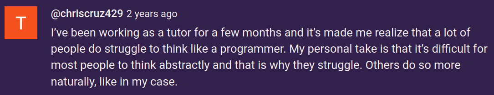
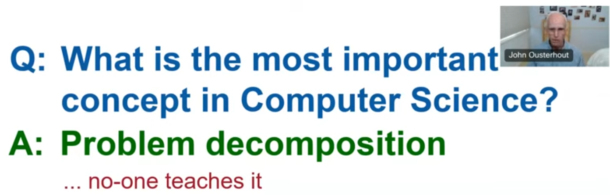
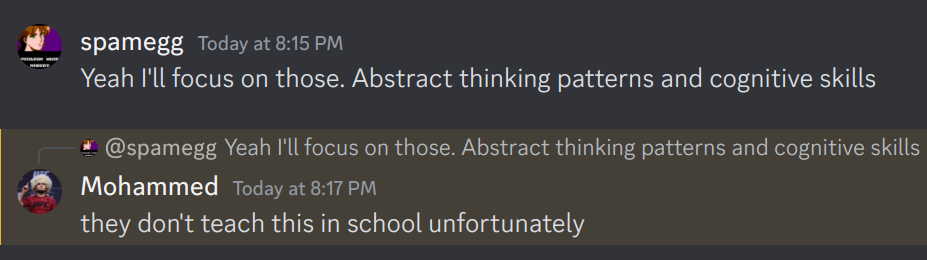

# Elements of Abstract Thinking

Welcome to the world of ***abstract nonsense!***

## Motivation

I've been trying to figure out the underlying reasons why many are struggling with mathematics and computer science, *even when they have great resources and they study the subjects.*

### The Usual Suspects

> ***It soon became clear that the unconscious instincts for logic and language which had enabled me to succeed were not shared by the large majority of my students.***
>
> - Susanna Epp (author of [Discrete Mathematics with Applications, 5th edition](https://www.amazon.com/Discrete-Mathematics-Applications-Susanna-Epp-ebook/dp/B07M87BWRC))

I don\'t accept the general / genetic explanation that "they're just not smart enough."

It seems there is something else going on. Even after finishing courses and passing tests / exams, or, *going through the motions*, students say "I don't feel like I've understood it."

### Journey

The journey went like this:

1. Students taking programming language theory, especially parts that are *rich in recursive thinking*, struggled.
2. First I falsely diagnosed the issue to be *recursion* and suggested studying it earlier.
3. That didn't help much.
4. I noticed the issue goes beyond recursion, and is more about having a poor mathematical background in general.
5. I suggested taking Mathematics for Computer Science earlier.
6. Some students could not make it past even Chapter 1, section 1 of Math for CS.
7. I suggested a much gentler, easier resource (Susanna Epp's book).
8. Students still struggled with that.

### The ever-elusive *maturity*

Students are told to "go get some [*maturity*](https://en.wikipedia.org/wiki/Mathematical_maturity) and [intuition](https://en.wikipedia.org/wiki/Logical_intuition)" but

1. it's not clear *what they are*,
2. nobody explains exactly *how to get them*.

### The usual advice

The general advice is to "keep doing it and eventually you'll start getting it", also known as *learning by osmosis*. Unfortunately I've seen examples where some students didn't get it even after 1-2 years of practice. The [research says](https://maa.org/wp-content/uploads/2024/06/2015-CUPM-Curriculum-Guide.pdf) that *"...experience alone is a poor teacher. Many learners don't know the quality of their comprehension..."*

Another common advice is to take Calculus first, to gain enough maturity for Discrete math and proofs. I've seen students who successfully completed 3 Calculus courses and then fail at even the most basic problems in Discrete Mathematics after months of study. (Once again, these students are not stupid, or lazy.)

The rare advice is to seek help from books such as

- [How to solve it](https://www.amazon.com/How-Solve-Mathematical-Princeton-Science-dp-069111966X/dp/069111966X/),
- [Book of proof](https://richardhammack.github.io/BookOfProof/),
- [The Little Prover](https://the-little-prover.github.io/)
- [The heart of mathematics](https://www.amazon.com/Heart-Mathematics-Invitation-Effective-Thinking/dp/1118156595).

This is good advice, and sometimes works, but some of these resources either
assume a decent mathematical background and maturity already,
or are too verbose / poorly translated, or too difficult for starters.

### Insights

The belief (and hope) is that math / CS "teaches you how to think." True, maybe? :thinking: But they require you to know how to think *a little*. What if you don't know how to think *at all ?* So we got a *recursive knowledge scaffolding* problem.

The issue is that math / CS subjects do not (usually) make abstract thinking *explicit*. Instead this thinking is *implicit* and "baked into" the subjects in subtle ways. They cover the "surface content" of the topics in an explicit fashion.

But unlike what the general advice says, the deeper, implicit thinking patterns go unnoticed by many students even after hundreds of hours of practice, instead of "automatically and subconsciously being picked up by your brain".

There does not seem to be any clear reason or pattern. Should we believe the "unconscious instinct" explanation and admit defeat?

### Not taught in school

According to [a Stanford prof](https://www.youtube.com/watch?v=LtRWu9DErgU), the most important thing is problem decomposition, and ***nobody teaches it:***

(He is also dealing with the questions "is it innate?" and ["can it be taught?"](https://www.youtube.com/watch?v=lgZ7Cxt5uIU))

Some students tend to agree:

### :bug: Opening :bug: a :bug: can :bug: of :bug: worms

The culprit seems to be the lack of abstract thinking skills, ***whatever the hell that is!***

Also the lack of problem solving skills, which are deeply connected to abstract thinking (breaking down a problem, modeling it, understanding the problem space, conceptualizing a solution...)

One more major issue, in my opinion, is the lack of metacognitive skills. Students are not aware of their thought processes. Metacognition itself can be abstract.

There is simply no way around this. Abstract thinking *HAS TO BE LEARNED.* And I believe *it can be taught,* even if it's just by making it a bit more explicit and not much else!

***And here we are...***

## What this is

- A loose collection of the common abstract patterns and ways of thinking found everywhere, which
  - are *implicit*, *intrinsic* and *invisible*,
  - *underlie* all the subjects we study;
  - plus metacognitive skills.
- It's ***an extremely rough draft for now***, hopefully it will be fleshed out later, with lots of examples.
  - So, there are probably many references to things you don't know.
- This is about ***abstract thinking within the context of mathematics and computer science.***
  - There are similarities to the scientific method:
    - observations, hypotheses, evidence, testing
  - but they are not the focus.

## What this is *not*

- This is not about abstract thinking in the [broadest sense](https://en.wikipedia.org/wiki/Abstraction#As_used_in_different_disciplines):
  - in science, [art](https://en.wikipedia.org/wiki/Mathematics_and_art), music, literature,
  - in politics, religion,
  - in military, business,
  - in decision making, etc.
- This is not comprehensive, or hierarchical / strictly organized:
  - thinking patterns are tied to each other in a messy tangled web,
  - it's near impossible to make them hierarchical.
  - Hence, "elements."
- This is not a coverage of the Math / CS topics that are mentioned.
  - It could be *embedded* into a math / CS curriculum *while* those topics are being taught;
  - giving much clearer understanding.

## How to Use

*Still work in progress!*

This is not a piece of software you can run, or a list of math problems you can solve.
It's just... thinking. So it is a bit difficult to use at first.

Read through the list of elements below, in linear order. Each section has examples.
While reading, have pen and paper to think through the ideas being explained.

At the end of each section there is also an exercise to put that thinking to practice.
These exercises (usually) do not have right or wrong answers, they are more open-ended.
Once again, have pen and paper at the ready and write out your ideas.
Then you can check *one of the many possible solutions* I outline at the end.

After having done all that, you might still be wondering what to do, or how to use them.
I will try to provide more exercises... but it's time to pick up a math or CS book
and start solving, while being *conscious* of using which
of the thinking patterns you learned.

***So... here we go!***

## The List of Elements

***First, the human side of things:***

[Our physical senses and the world](physical/README.md)

[Our subconscious stuff](subconscious/README.md)

[The meta stuff in our heads](meta/README.md)

***Now the more technical side of things:***

[The logical stuff](logic/README.md)

[Many ways of thinking](ways/README.md)

[The many joys of world building](world/README.md)

[The abstract stuff](abstract/README.md)

[The big, complex, combined stuff](complex/README.md)

[Problem solving](solve/README.md)
