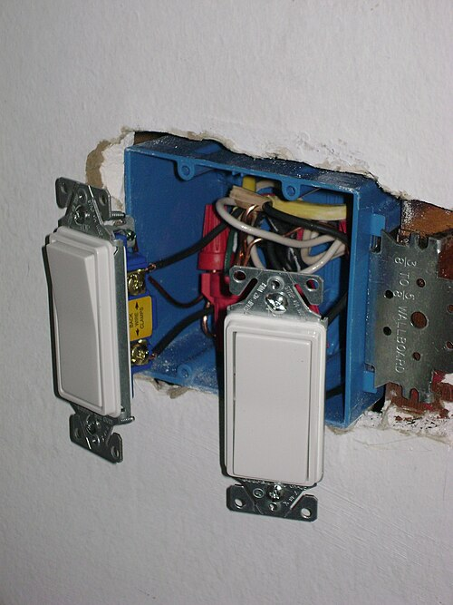
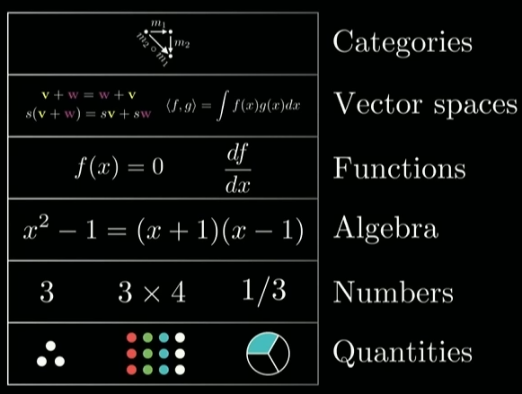

# Abstraction

## Many meanings of abstraction

1. Generalization
2. Hiding details (design vs. implementation)
3. Making things unreal, imaginary by removing context and application
4. Recognizing common patterns and turning them into building blocks

There are probably many more! But we'll stick to these.
These four have some similarities and common aspects,
but we won't split them further into even smaller ideas (it gets *too abstract*).

## Generalization and Specialization

There are various techniques in math and computer science for this:

- Universal and existential quantification
- Parametrization
- Contextual generalization (connection to implicits)
- Abstraction and reification

### An example of generalization: area / volume

Area in the naive, physical sense:

- how much water does it take to fill some flat surface container (of unit height)?

Start simple:

- squares: $A = s \times s$,

Then generalize to:

- rectangles: $A = w \times h$,
- triangles: $A = w \times h / 2$,
- regular polygons: add up the triangles,
- irregular polygons (break up into regular polygons, triangulation),
- areas under arbitrary *continuous* curves of a single variable over *an interval*:
  - add up areas of rectangles over the interval, take limit: Riemann integral
- *piecewise continuous* curves over *an interval,*
- *integrable curves* over *an interval*,
- *integrable curves* over *the partitioning of an interval by a function of bounded variation,*
  - this is called the
    [Riemann-Stieltjes integral](https://en.wikipedia.org/wiki/Riemann%E2%80%93Stieltjes_integral),
- *integrable curves* over *measurable sets*: Lebesgue integral,
- the $p$-adic numbers instead of the reals $\mathbb{R}$,
- an integral over a *locally compact topological group* with a *left-invariant Haar measure*:
  - abstract harmonic analysis!
- higher-dimensional, multi-variable versions of these (volume, hypervolume etc.)

## Hiding details

TODO

### An example of detail hiding

The light switch is an abstraction that hides away the details of its inner workings.

## Removing context and application

TODO

### An example of context removal

- Start with real-world, often physical, observations of objects.
- Remove "special properties" (or "context") from the real world:
  - If you are looking at a picture with three different lions,
  - first remove their differences (now they are just "three lions"),
  - then remove their "lionness" (now they are just "three animals"),
  - then remove their "animalness", etc.
  - this is called making it context-free.
- Look for:
  - relations between them:
    - lion X is "to the left of" lion Y, lion Y is "in front of" lion Z, etc.
  - properties they might have:
    - "three-ness": being comprised of 3 entities
  - operations that act on them:
    - TODO
  - This is the most difficult part and cannot be taught completely.
- Now see if the objects / entities can be replaced with others.
  - Do the properties / relations still hold?
- Now see if the operations could be replaced with others:
  - Do they still work?

## Recognizing patterns and turning them into building blocks

TODO

### Hierarchical building blocks

TODO

### An example of creating building blocks

TODO

## Complex example with many meanings of abstraction together

TODO

[Back to the abstract stuff](README.md)
