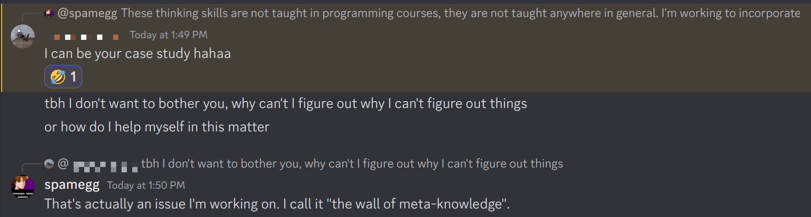

# Meta-knowledge

- I know something.
  - I know that I know it.
  - I *learned it*, I *should* know it but I'm not confident.
  - To convince myself I should teach it to others.
- I don't know *something*.
  - Sometimes I don't know that I don't know something.
  - Sometimes I can *feel* that I lack something, but I don't know *what it is that I don't know.*
    - I call this ***hitting the wall of meta-knowledge.*** (OUCH)
  - I can't figure out why I can't figure out things.
  
  
  
  - I know what I lack, but I don't know where to go or how to acquire it.
- I know what others don't, or I don't know what others know.
  - Others don't know that I know something.
  - I know that I know something but I can't explain it to others.
    - I'm not sure if *they* know what I'm talking about.
    - Are they missing some prerequisite knowledge to understand it?
  - I can't understand what others "see" in something.
    - They get it, I don't, and I'm not sure why.
    - Am I missing some prerequisite knowledge to understand it?

## Work in progress!

[Back to Elements](README.md#meta-knowledge)

