# Physical world

Many abstract ideas in math + CS come from physical reality and nature.

Here is a [survey article](https://doi.org/10.34133/research.0442)
of nature-inspired computing.

Here is a [wonderful site](https://natureofcode.com) with many
examples of math + CS ideas found in or inspired by nature.

## Examples

|     Abstract version| ↔ |Physical version                        |
|--------------------:|:-:|:---------------------------------------|
|addition, subtraction| ↔ |putting things together, removing things|
|       transformation| ↔ |bending / stretching / shifting objects |
|         modus ponens| ↔ |cause and effect                        |
| traits, polymorphism| ↔ |genetics                                |
|            recursion| ↔ |plants, shells, other life forms        |
|software architecture| ↔ |physical architecture                   |
|      neural networks| ↔ |human brain                             |
|    OS task switching| ↔ |multi-tasking of the human brain        |

## Example: seashells and cellular automata

Some life forms like seashells exhibit interesting patterns:

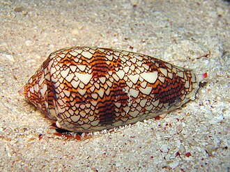

(Image credit: Copyright (c) 2005 Richard Ling, used under
[CC3.0 license](https://creativecommons.org/licenses/by-sa/3.0/deed.en))

This kind of phenomenon can happen in real life due to some simple physics and chemistry
of the molecules that create the pigmentations, in addition to the information
stored in the genetics of the life form for various reasons (like camouflage).

We can abstract away the mechanism that generates these patterns.

1. We can first simplify it:
    - assume there are only 2 colors, and
    - assume it's all on a grid.

2. We can imagine some simple rules that determine the colors of a square on the next row,
  based on the square on the current row, and two of its surrounding squares (left+right).
  For example, if it's `WHITE WHITE WHITE` then the next square in the middle
  could also be `WHITE`:

    ||left|mid|right|
    |:-:|:-:|:-:|:-:|
    |current|WHITE|WHITE|WHITE|
    |next|???|WHITE|???|

    Based on this idea, there would have to be 8 rules.

3. By looking at the seashell we can get some inspiration and play around with some rules.
  As a result, this is the pattern that's generated
  (with the 8 rules depicted at the bottom of the image):

    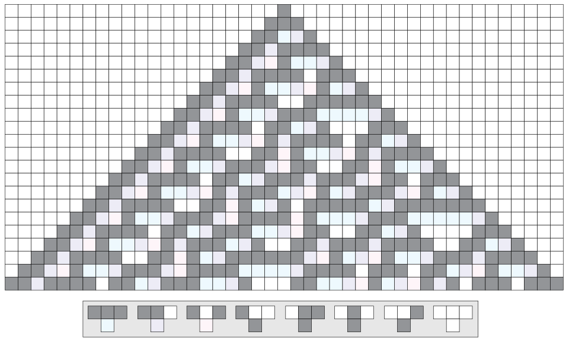

    (Image credit: [Nonenmac](https://en.wikipedia.org/wiki/User:Nonenmac)
    at [English Wikipedia](https://en.wikipedia.org/wiki/),
    used under [CC3.0 license](https://creativecommons.org/licenses/by-sa/3.0/deed.en))

This type of idea can be taken much further to give rise to cellular automata.
It gets extremely deep: this simple discrete model of computation is shown to be
Turing complete, i.e. capable of emulating any arbitrary computation!

## Exercise: create abstract ideas from physical things

### Rolling a 4-sided die

Consider a 4-sided die, where I marked the four corners with numbers
(we could have also marked the four faces instead):


Now think about rolling this die. It will land in some way on one of its four faces.

For simplicity, let's assume that it lands in the same "pose" (called a *symmetry*),
except the faces and corners might have been switched around in some way
(otherwise there are infinitely many possibilities). For example:


What kinds of things can happen to the positions of the four corners
as a result of rolling the die and having it land in different ways?

#### Orientation

First notice that since this is a solid physical object,
certain configurations are not possible. For example:


Here 2 and 3 switched places while keeping the rest of the die intact,
which would be equivalent to bending or twisting it somehow.
This is not possible for a hard solid object just by rolling it.
(In other words, rolling a die *preserves its orientation*.)

Keeping this in mind, we can draw all the possibilities. There are 12 of them:


But this is not the abstract idea I want you to come up with!

#### Exercise: abstracting the die rolls

1. How (in the physical sense) can you move the die between these three states:

    

    Can you come up with an abstract version of these movements?
    How would you describe them? Symbols? Figures? Notation?
    Are there relations between them? Can one be described in terms of another?

2. How can you move the die between these three states:

    

    Is there a similarity between this and how you can move between the previous 3?

3. Think similarly to 1-2 for the other states:

    These three:

    

    And these three:

    

4. Can you think of a way to "combine" the moves from 1 with the moves from 2 or 3?
  Are there any relations between combinations? What can you say about them?

5. How to move (in the physical sense) between these two?

    

    Can you come up with an abstract version of this movement?

6. How to move between these two?

    

    Is there a similarity between this and the previous?

7. Think similarly to 5-6 to move between these two:

    

8. Can you now list all 12 moves, using your descriptions?
  Each one of the 12 moves should start from the initial die position:

    

  and end with one of the 12 positions (including the initial itself).

#### Solution

1. We can move by a rotation around the vertical axis:

    

    Such a rotation leaves the "top of the pyramid" unmoved and just rotate "the base".

    These rotations can be 120° (to move from the 1st to the 2nd,
    or from the 2nd to the 3rd, or from the 3rd to the 1st),
    240° (1st -> 3rd, 2nd -> 1st, 3rd -> 2nd).
    If the rotation is 360° then it does not change anything.

    Abstractly we can use algebraic notation.
    Let's give the rotation some name.
    It fixes the point 4, so maybe call it $r_4$.
    This is a 120° counter-clockwise rotation.

    Then the 240° rotation is the same as $r_4$ applied twice in a row!
    There are many ways to represent this. We could use a string $r_4r_4$
    where the rotations are applied left-to-right, or right-to-left if we choose.
    Or we can think of "applying rotations in a row" as "multiplication",
    so it could be notated as $r_4^2$.

    Symbolically we can also think of it as "function application" so it's right-to-left:

    

    

    Then applying $r_4$ three times in a row gets us back to the same state,
    in other words it does nothing. It's like 0 in addition or 1 in multiplication.
    This is called an "identity" element. Let's call this move $I$.
    Then algebraically $r_4^3 = I$. We could say that $r_4$ "has degree 3".

    Warning! This "multiplication" notation needs some care, because it won't be
    the same as the usual multiplication of numbers. Order matters!
    Normally $2 \times 3 = 3 \times 2$ but if we get different kinds of rotations
    then they may not work like this. Applying one rotation first, then another second
    may not be the same as the other way around.
    In other words they might not be *commutative*.

2. Similarly we can think of a rotation $r_3$ such that $r_3^3 = I$.
3. Similarly we can think of rotations $r_1$ and $r_2$.
4. If we apply $r_1$ then $r_2$ here's what happens:

    

    Notice that applying $r_1$ and then $r_2$, is the same as just applying $r_4$.
    Weird! So if we use the right-to-left algebraic notation: $r_2r_1 = r_4$.

    You can play around with many combinations for fun.
    Try to find other "algebraic laws" like this!
    There are way too many of them, I don't expect you to write them all down.
    [Here is a list](https://proofwiki.org/wiki/Alternating_Group_on_4_Letters)
    in case you are curious (although they use different notation).

5. This can be done by a 180° rotation around an axis like this:

    

    Such a rotation swaps 1 with 2, and swaps 3 with 4.
    Since this is a 180° rotation, applying it twice does nothing.
    So, if we call it $r_{12,34}$, then $r_{12,34}^2 = I$. So it has order two.

6. You can find a similar axis with a 180° rotation that swaps 1-3 and 2-4.
7. You can find a similar axis with a 180° rotation that swaps 1-4 and 2-3.
8. Let's start by listing all 12 that we have:
  $I, r_1, r_1^2, r_2, r_2^2, r_3, r_3^2, r_4, r_4^2, r_{12,34}, r_{13,24}, r_{14,23}$.

  Normally we would have to be careful that there isn't some subtle relation between
  these that causes a repetition, in other words we'd have to make sure that
  these moves are all different from each other. But let's not worry about that for now.

  Here is ONE WAY to describe the 12 moves (there are many other, equivalent ways).
  If we number all the states like this

  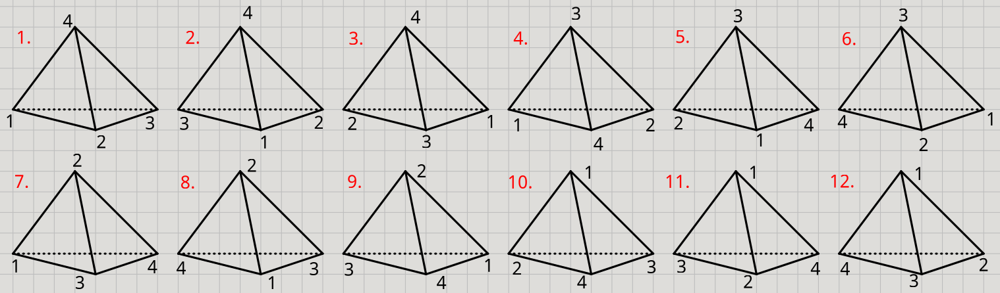

  then:

  1. $I$ moves `1.` to `1.`

      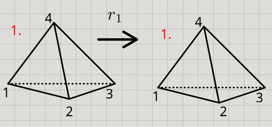

  2. $r_1$ moves `1.` to `7.`

      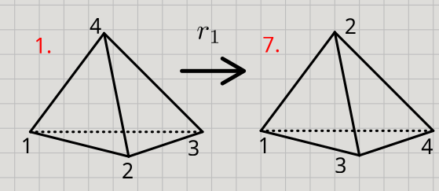

  3. $r_2$ moves `1.` to `6.`

      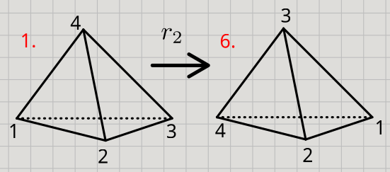

  4. $r_3$ moves `1.` to `8.`

      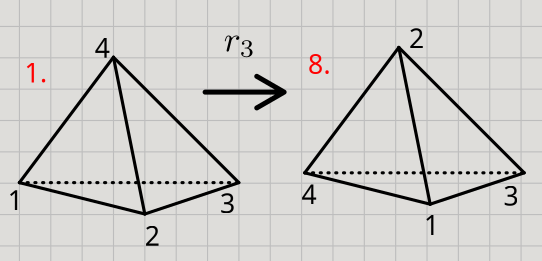

  5. $r_4$ moves `1.` to `2.`

      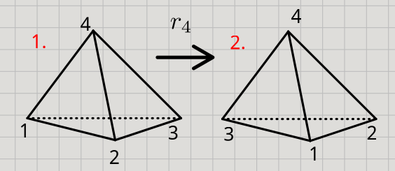

  6. $r_1^2$ moves `1.` to `4.`

      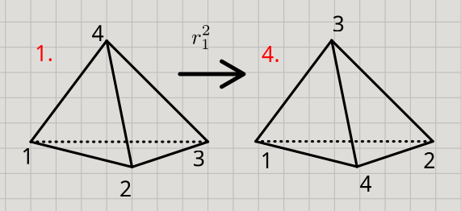

  7. $r_2^2$ moves `1.` to `11.`

      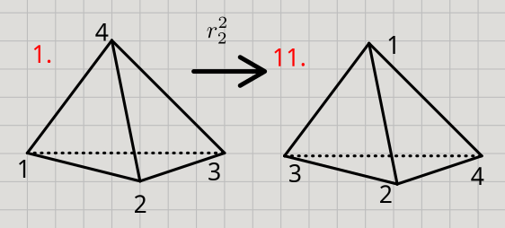

  8. $r_3^2$ moves `1.` to `10.`

      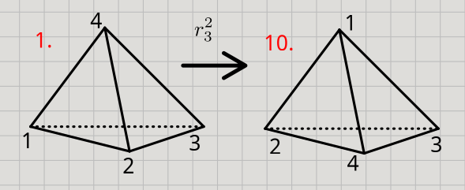

  9. $r_4^2$ moves `1.` to `3.`

      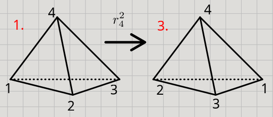

  10. $r_{12,34}$ moves `1.` to `5.`

      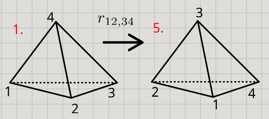

  11. $r_{13,24}$ moves `1.` to `9.`

      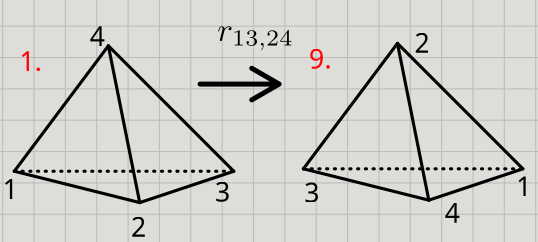

  12. $r_{14,23}$ moves `1.` to `12.`

      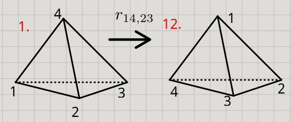

## Exercises: find physical analogies that correspond to abstract ideas

Here we are looking for *just analogies.*
Not physical phenomena that perfectly correspond to the ideas.
Can you think of a physical analogy to these ideas?
There are many possibilities. Try to think of a verb for each one, if possible.

### Exercise 1

Consider working through a list of numbers and adding them up, or multiplying them:

```py
[1, 2, 3, 4, 5, 6, 7, 8, 9]
   [3, 3, 4, 5, 6, 7, 8, 9]
      [6, 4, 5, 6, 7, 8, 9]
        [10, 5, 6, 7, 8, 9]
           [15, 6, 7, 8, 9]
              [21, 7, 8, 9]
                 [28, 8, 9]
                    [36, 9]
                        45
```

### Exercise 2

Consider a list that contains other lists, and converting them all into a single list.
For example, turning this:

```py
             8
      4      9
   2  5     10  12
1, 3, 6, 7, 11, 13
```

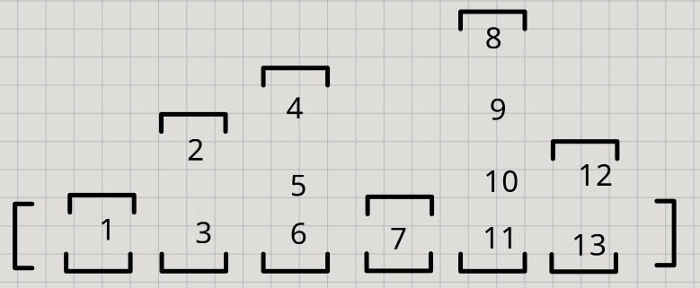

into this:

```py
[1, 2, 3, 4, 5, 6, 7, 8, 9, 10, 11, 12, 13]
```

### Exercise 3

In two or three dimensional Cartesian coordinate systems, points like $(x, y)$
or $(x, y, z)$ can be converted to lower dimensional versions:

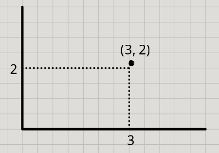

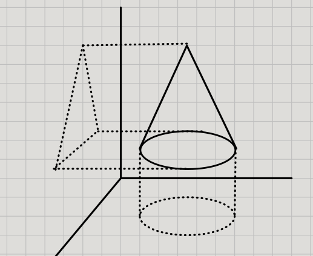

The same abstract idea works more generally in higher dimensions too.

### Solutions

Obviously there is no right or wrong answer here.
If you found other analogies, great!

1. Folding: think of it like folding a long piece of paper little by little in stages.
  Another good one is "snowballing" or "avalanche"! 😄
2. Flattening: like pushing it down to the ground or taking the air out of it.
3. Projecting: like how light can be projected onto walls or screens.

[Back to our senses and the physical world](README.md)
