# Physical world

Many abstract ideas in math + CS come from physical reality.

## Examples

|     Abstract version| ↔ |Physical version                        |
|--------------------:|:-:|:---------------------------------------|
|addition, subtraction| ↔ |putting things together, removing things|
|       transformation| ↔ |bending / stretching / shifting objects |
|         modus ponens| ↔ |cause and effect                        |
| traits, polymorphism| ↔ |genetics                                |
|            recursion| ↔ |plants, shells, other life forms        |
|software architecture| ↔ |physical architecture                   |
|      neural networks| ↔ |human brain                             |
|    OS task switching| ↔ |multi-tasking of the human brain        |

Here is a survey [article](https://doi.org/10.34133/research.0442)
of nature-inspired intelligent computing.

## Exercises: create abstract ideas from physical things

### Rolling a 4-sided die

Consider a 4-sided die, where I marked the four corners with numbers
(we could have also marked the four faces instead, it doesn't matter):

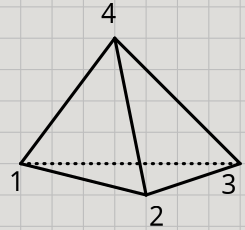

Now think about rolling this die. It will land in some way on one of its four faces.

For simplicity, let's assume that it lands in the same "pose" (called a *symmetry*),
except the faces and corners might have been switched around in some way
(otherwise there are infinitely many possibilities). For example:

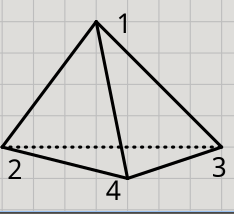

What kinds of things can happen to the positions of the four corners
as a result of rolling the die and having it land in different ways?

#### Orientation

First notice that since this is a solid physical object,
certain configurations are not possible. For example:

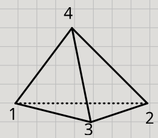

Here 2 and 3 switched places while keeping the rest of the die intact,
which would be equivalent to bending or twisting it somehow.
This is not possible for a hard solid object just by rolling it.
(This is called *preserving the orientation*.)

Keeping this in mind, we can draw all the possibilities. There are 12 of them:

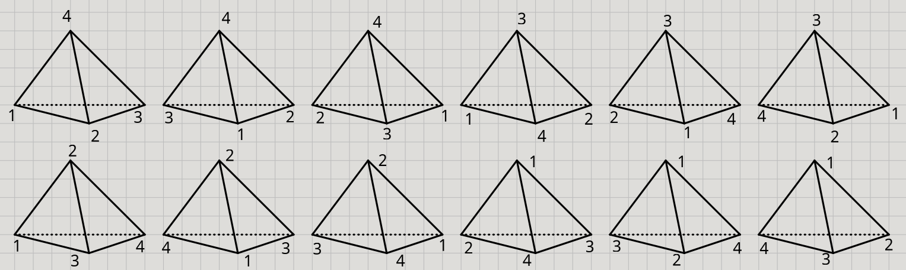

But this is not the abstract idea I want you to come up with!

#### Exercise: abstracting the die rolls

1. Think about how (in the physical sense) you can move between these three states:

    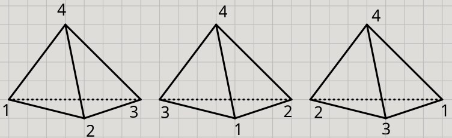

    Can you come up with an abstract version of these movements?
    How would you describe them? Symbols? Figures? Notation?
    Are there relations between them? Can one be described in terms of another?

2. How can you move between these three states:

    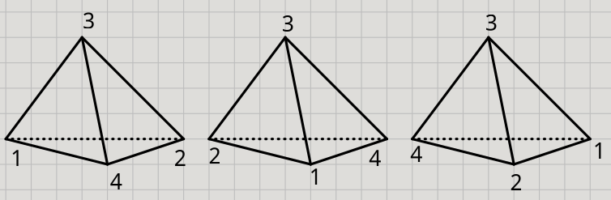

    Is there a similarity between this and how you can move between the previous 3?

3. Think similarly to 1-2 for the other states:

    These three:

    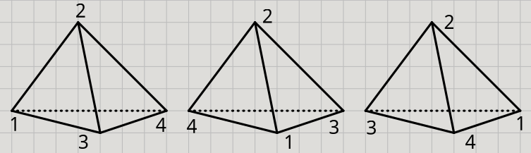

    And these three:

    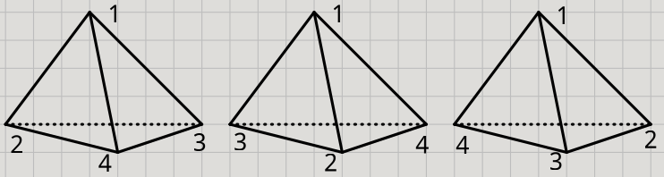

4. Can you think of how to "combine" the moves from 1 with the moves from 2 or 3?

5. How to move (in the physical sense) between these two?

    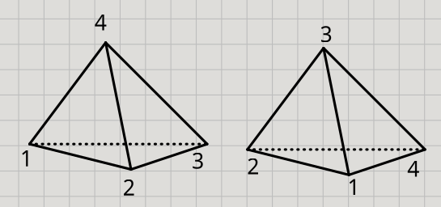

    Can you come up with an abstract version of this movement?

6. How to move between these two?

    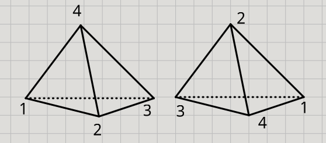

    Is there a similarity between this and the previous?

7. Think similarly to 4-5 to move between these two:

    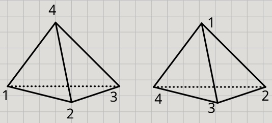

#### Solution

1. We can move by a rotation around the vertical axis:

    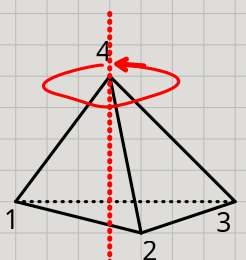

    Such a rotation leaves the "top of the pyramid" unmoved and just rotate "the base".

    These rotations can be 120° (to move from the 1st to the 2nd,
    or from the 2nd to the 3rd, or from the 3rd to the 1st),
    240° (1st -> 3rd, 2nd -> 1st, 3rd -> 2nd).
    If the rotation is 360° then it does not change anything.

    Abstractly we can use algebraic notation.
    Let's give the rotation some name.
    It fixes the point 4, so maybe call it $r_4$.
    This is a 120° counter-clockwise rotation.

    Then the 240° rotation is the same as $r_4$ applied twice in a row!
    There are many ways to represent this. We could use a string $r_4r_4$
    where the rotations are applied left-to-right, or right-to-left if we choose.
    Or we can think of "applying rotations in a row" as "multiplication",
    so it could be notated as $r_4^2$.

    Symbolically we can also think of it as "function application" so it's right-to-left:

    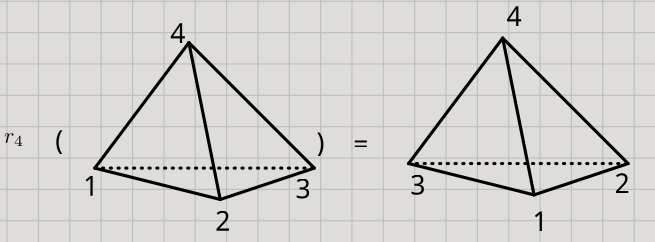

    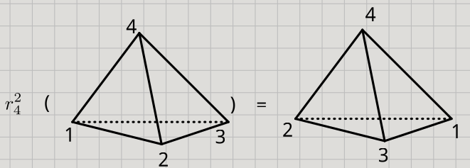

    Then applying $r_4$ three times in a row gets us back to the same state,
    in other words it does nothing. It's like 0 in addition or 1 in multiplication.
    This is called an "identity" element. Let's call this move $I$.
    Then algebraically $r_4^3 = I$.

    Warning! This "multiplication" notation needs some care, because it won't be
    the same as the usual multiplication of numbers. Order matters!
    Normally $2 \times 3 = 3 \times 2$ but if we get different kinds of rotations
    then they may not work like this. Applying one rotation first, then another second
    may not be the same as the other way around.
    In other words they might not be *commutative*.

2. Similarly we can think of a rotation $r_3$ such that $r_3^3 = I$.
3. Similarly we can think of rotations $r_1$ and $r_2$.
4. If we apply $r_1$ then $r_2$ here's what happens:

    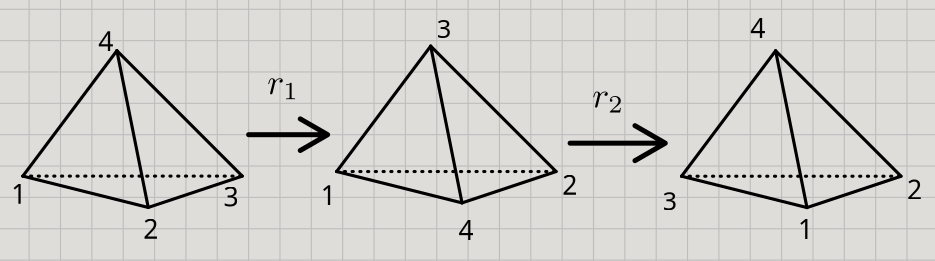

    Notice that applying $r_1$ and then $r_2$, is the same as just applying $r_4$.
    Weird! So if we use the right-to-left algebraic notation: $r_2r_1 = r_4$.

    You can play around with many combinations for fun.
    Try to find other "algebraic laws" like this!

5. This can be done by a 180° rotation around an axis like this:

    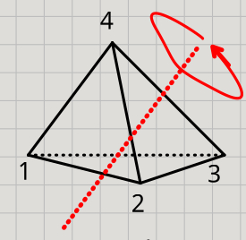

    Such a rotation swaps 1 with 2, and swaps 3 with 4.
    Since this is a 180° rotation, applying it twice does nothing.
    So, if we call it $r_{12,34}$, then $r_{12,34}^2 = I$.

6. You can find a similar axis with a 180° rotation that swaps 1-3 and 2-4.
7. You can find a similar axis with a 180° rotation that swaps 1-4 and 2-3.

## Exercise: find physical analogies that correspond to abstract ideas

What we are looking for here are *just analogies.*
Not physical phenomena that perfectly corresponds to the idea.

- Folding
- Flattening
- Projection

TODO

[Back to our senses and the world](README.md)
