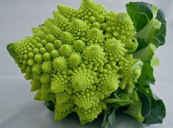

# Recursive thinking



## recursive computations

This explanation is from [Big Java: Early Objects 7ed](https://www.wiley.com/en-us/Big+Java%3A+Early+Objects%2C+7th+Edition-p-9781119499091) by Cay Horstmann.

A recrusive computation solves a problem by using the solution to a simpler version of the problem, to solve the original problem.

For example, if we look at a triangle made from shapes such as this one:
```
[]
[][]
[][][]
```
We’d like to compute the area of the triangle assuming each square has area 1.

You may know there is a simple formula for computing the area of a triangle, `base * height / 2`, but the purpose of this example is to explain the concept of recursion by walking through an example.

If the width of the triangle is 1, then the triangle consists of a single square, and the area is 1.

To deal with the general case, consider this picture:
```
[]
[][]
[][][]
[][][][]
```
Suppose we knew the are of the upper triangle with width 3. Then we could easily compute the area of the larger traingle as:
`smallerTriangleArea` + `width`.

How can we get the area of the smaller triangle?

```
[]
[][]
[][][]
```
Similar to before, if we knew the area of the smaller triangle with width 2, then we could easily compute the area of the triangle with width 3 as:
`smallerTriangleArea` + `width`.
```
[]
[][]
+
[][][]
=
[]
[][]
[][][]
```
Now we can complete a recursive computation for getting the area of any given triangle:
```
if area is equal to 1, the area of this triangle is 1
otherwise, the smaller triangle is the triangle with width equal to this traingle's width - 1
and the area of this triangle is equal to the area of the smaller triangle plus the width of this triangle.
```
or, in pseudocode:
```
if this.width == 1 { area = 1 }
else {
  smallerTraingle = Triangle(width = this.width - 1)
  area = smallerTriangle.getArea() + this.width
}
```
The computation: `smallerTriangleArea` + `width` will repeat itself until the area of the triangle is 1, at which point all the computaitons will be computed like so:
```
[]
+
[][]
=
[]
[][]
+
[][][]
=
[]
[][]
[][][]
+
[][][][]
=
[]
[][]
[][][]
[][][][]
```
This solution has 1 remarkable quality. To solve the area problem for a triangle of a given width, we use the fact that we can solve the same problem for a triangle of lesser width. This is called a _recursive_ solution because the same computation recurs, i.e. repeats itself.

You only need to figure out how to combine the solution to a simpler version of the problem, in this case the area of the smaller triangle, with the extra input of your problem, in this case the width, to find a solution to your problem, the area of the triangle with the wider base.

### the mental model for coming up with recursvie solutions:

The steps to follow when coming up with a recursive solution are the following:
1. consider various ways to simplify the inputs, e.g. the area of the smaller triagle
2. combine solutions with simpler inputs into a solution for the original problem, e.g. `smallerTraingleArea` + `width` 
3. find solutions to the simplest inputs, e.g. `if (width == 1) { area = 1 }`
4. implement the solution by combining the simple cases, and the simplification followed by combination step. e.g.
```
if this.width == 1 { area = 1 }
else {
  smallerTraingle = Triangle(width = this.width - 1)
  area = smallerTriangle.getArea() + this.width
}
```

## Work in progress

[Back to Elements](README.md#recursive-thinking)
