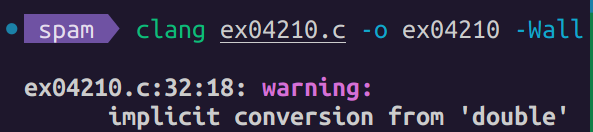

# Implicit and explicit knowledge

## Assumptions and background knowledge

Assumptions and background knowledge are unavoidable and necessary.

### Examples of implicit assumptions

TODO

### How to deal with assumptions: expect them and watch out

TODO

## Moving between implicit and explicit

- Always keep dancing back and forth between:
  - implicit and explicit knowledge,
  - syntax and semantics,
  - formal and informal,
  - abstract and concrete,
  - yourself and others,
  - theoretical and practical.
- Being aware of:
  - what's needed,
  - what's missing,
  - the surrounding context,
  - to which paradigm / modality something belongs,
  - self and other-knowledge (see below).
- Make it explicit!
  - Play the role of "math lawyer": write a *bullet-proof definition*.

## Implicit conversions

- Converting one idea / concept / assumption to another, without being aware of it.
- Found in math, programming, and a natural function of our brains.
  - which makes it an interesting example of meta-thinking!
- It happens all the time without us noticing.

### Examples of implicit conversions

TODO

## Contextual thinking

TODO

### Context switching

TODO

## Work in progress

[Back to our subconscious stuff](README.md)
