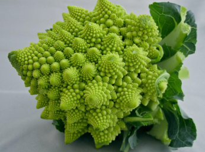

# Recursive thinking

## Self reference

TODO

### Circularity, impredicativity and related problems

TODO

## Self similarity

TODO

### The beauty of fractals

TODO

## Difficulties in recursive thinking

### Anti-temporality

TODO

### Reverse chronology

TODO

### The rug being pulled from under you

TODO

## Thinking forward

### Generative recursion

Start from base, go forward.

TODO

### Building up

TODO

## Thinking in reverse

### Destructuring

Start from the whole, go backward.

TODO

### Reduction to the base case

TODO

## Exercise

TODO

[Back to Many ways of thinking](README.md)
